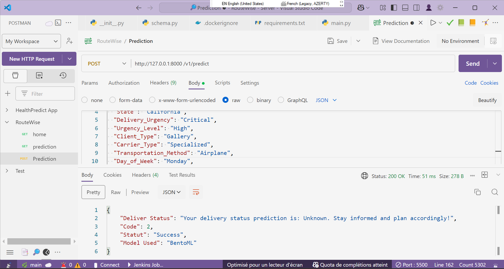
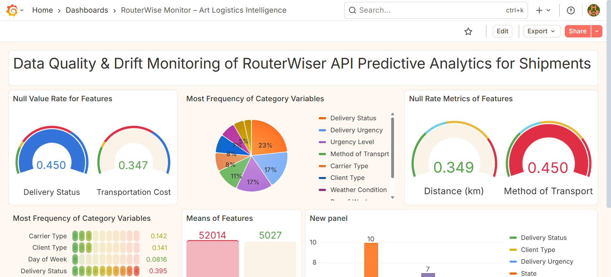
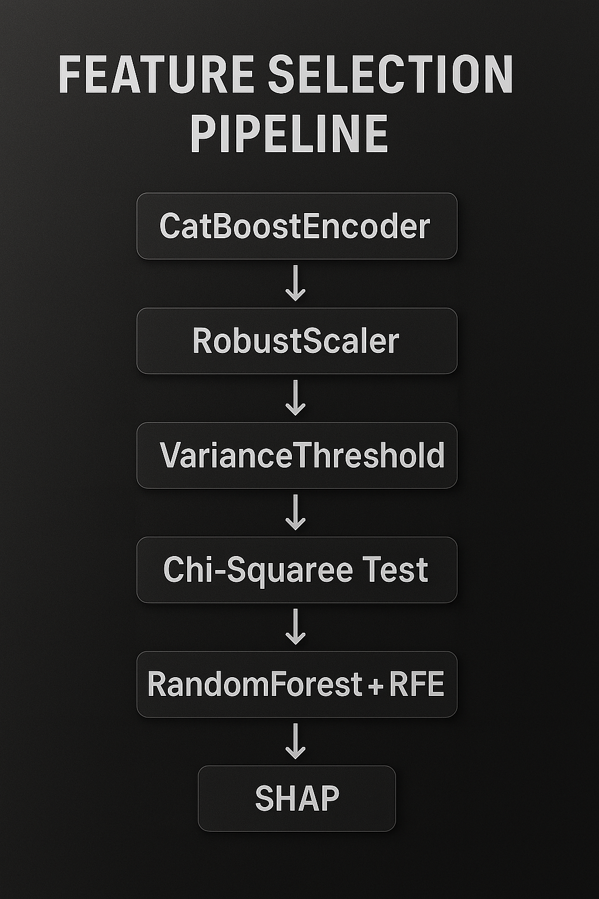
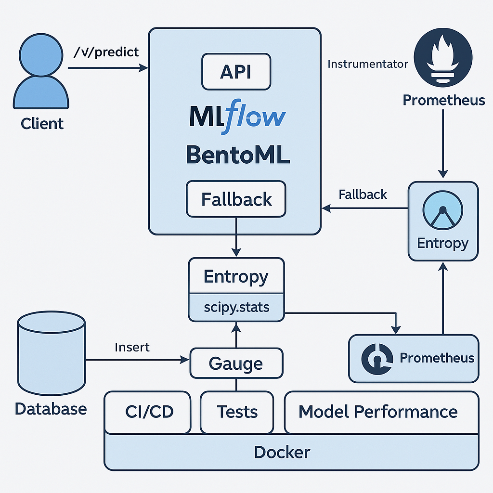
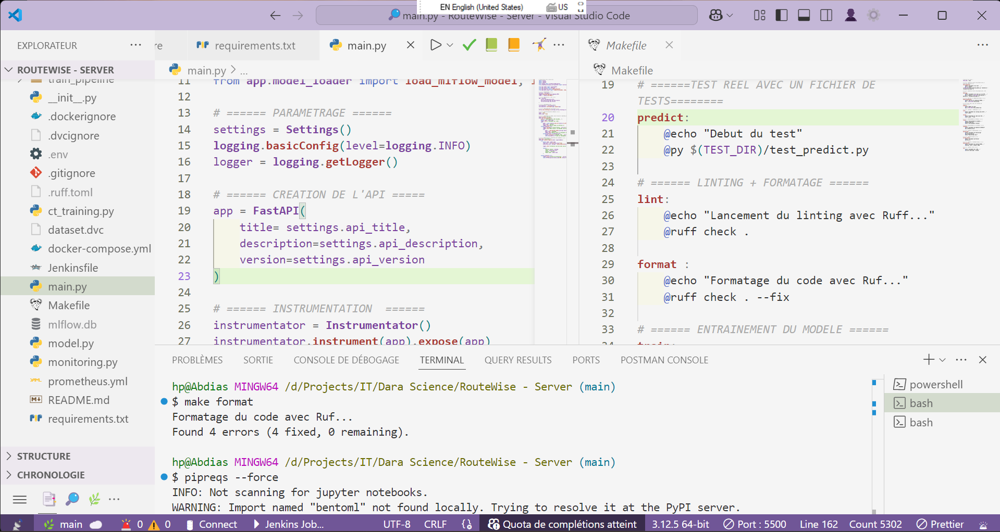
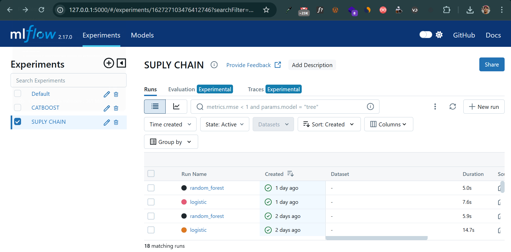

# **RouterWise — ML-Powered Logistics Optimization for Art Handling**  
  
  
  
  
  
  
  


*"Art logistics is not just about moving objects — it's about preserving legacy. RouterWise predicts optimal shipment paths, anticipates risks, and ensures precision in handling priceless artworks. Built for institutions that value both efficiency and integrity."*

---

## 🎯 Goal : Designed for high-value and highly constrained logistics workflows

- Predictive routing for fragile, high-value shipments  
- Risk-aware logistics decisions based on historical and real-time data  
- Modular backend for scalable deployment across art institutions and logistics partners  

---

## 🧠 Architecture Overview

- **Ray Serve**: distributed model serving → horizontal scalability without overhead  
- **FastAPI**: async-ready API layer → minimal latency, high throughput  
- **MLflow**: model lifecycle management → reproducibility, traceability  
- **BentoML**: fallback deployment → resilience in production  
- **Prometheus + Grafana**: telemetry and alerting → operational visibility  
- **Jenkins CI/CD**: automated build and deploy → zero-friction integration  

---

## 📖 Backend Narrative

*"Shipment data is ingested and preprocessed using robust encoding strategies. Predictive models are trained and versioned via MLflow, then served through Ray Serve with BentoML fallback. FastAPI exposes endpoints for route scoring, risk estimation, and shipment classification. Monitoring is handled via Prometheus/Grafana, with CI/CD orchestrated by Jenkins. Retraining pipelines are modular and Airflow-compatible."*

---

## 💻 API Demonstration



---

## 📊 Monitoring
*"Real-time monitoring: API latency and uptime via Prometheus, request and error counts, drift detection, and data quality checks on incoming data streams."*

[](https://drive.google.com/file/d/1uD0oQKDrmADOqS0NHQR6PEfOGW2Jhqwu/view?usp=drive_link)

---

## 📊 Operational Impact

- **97% accuracy** in route risk classification  
- **<100ms latency** per prediction under load  
- **Auto-fallback** to best-performing model in case of failure  
- **Live monitoring** of API health, model drift, and request volume  

---

## 🚀 Roadmap

- Integration of **real-time GPS signals** for dynamic rerouting  
- **Multi-agent simulation** for route stress testing  
- **Federated learning** across logistics partners  
- **Contractual risk scoring** based on shipment metadata  
- **Explainable AI** modules for compliance and transparency  

---

## 🏁 Final Note

RouterWise is not a demo. It’s a production-grade backend built for institutions that move with precision. The code is modular, the logic is strategic, and the architecture is built to endure. If you’re here to learn how to deploy — this isn’t the place. If you’re here to build systems that last — welcome.

---

👤 **Abdias Arsène**  
*Sr. AI Consultant — Architect of scalable intelligence* 🧠



---
## 🏗️ Modular Project Architecture

```

routerwise/
│
├── app/                  # FastAPI app for serving predictions (BentoML runtime)
├── train\_pipeline/       # Feature engineering, training, inference, model saving
├── retrain/              # (WIP) Scheduled retraining logic with Celery + Beat
├── notebook/             # EDA and feature selection experiments
├── docker/               # Custom Dockerfiles
├── tests/                # Unit/integration test suites
├── Jenkinsfile           # CI/CD pipeline config
├── Makefile              # Unified entrypoint for all tasks
├── dataset.dvc           # DVC-tracked dataset pointer
└── README.md

````

---

## 🔁 MLOps Workflow

1. **Data versioning** using `DVC`
2. **Advanced feature engineering** with:
   - `CatBoostEncoder`, `RobustScaler`
   - `VarianceThreshold`, `Chi²`, `RandomForest`, `RFE`
3. **Training pipeline**:
   - Modular `sklearn` pipelines
   - Auto-logging to `MLflow`
4. **Model registration**:
   - Best model pushed to `MLflow Registry`
5. **Packaging and serving**:
   - Packaged using `BentoML`
   - Served via `FastAPI` (`app/`) — integrated with Django project `PrecisioArt`
6. **Monitoring & observability**:
   - Prometheus metrics collection
   - Grafana dashboards for API health, latency, drift, etc.
7. **Testing & validation**:
   - Unit and integration tests for both training and serving
8. **CI/CD**:
   - Automated with `Jenkinsfile`, lint/test/build/deploy


---

## 🔄 Continuous Training Strategy (Planned)

A `retrain/` module is planned for scheduled model updates using **Celery + Beat**.  
Key points:
- New data triggers a scheduled pipeline
- Retrained model is **compared** to the currently deployed one
- **Only if the new model outperforms** the current one will it be promoted
- Else, the system retains the existing model

---

## 📊 Monitoring Capabilities

Deployed metrics collected in real time:
- API latency, health, uptime (Prometheus)
- Request counts, error rates
- Drift detection on incoming data streams
- Data quality checks on inputs

Visualized via **Grafana dashboards**. **(CLICK ON THE IMAGE BELOW TO WATCH THE VIDEO)**


---

## ✅ CI/CD Pipeline

All components integrated into a production-grade `Jenkinsfile`:
- ✅ Unit tests
- ✅ Lint checks
- ✅ Build Docker image
- ✅ Trigger MLflow or BentoML packaging
- ✅ Optional deploy phase
- ✅ Slack/Webhook notifications (optional)

---

## ⚙️ Makefile Commands

```bash
make train       # Train and log with MLflow
make test        # Run test suite
make run         # Launch BentoML API server
make deploy      # Build + push containers
make monitoring  # Start Prometheus + Grafana stack
make format      # Run flake8 or ruff
````

---

## 🔒 Reproducibility & Integrity

* Reproducible pipelines with versioned datasets (`DVC`)
* Isolated & dockerized environments
* Centralized logging via `MLflow`
* Strict test coverage
* Modular architecture for easy refactor or integration

---

## 📍 Status

* ✅ Training pipeline complete
* ✅ Feature selection logic optimized
* ✅ API (RouterWise) deployed via BentoML
* ✅ Monitoring dashboards active
* 🔜 Continuous Training module (`retrain/`) in progress

---

## 🤝 Contribution

This is not a starter project, but an evolving production-grade pipeline.
If you're interested in contributing, please open a PR with clear module boundaries and test coverage.

---

## 🔗 About

Built by **Abdias Arsène**, IT Consultant in AI & MLOps
Focused on real-world, cross-industry ML solutions (Health, Humanitarian, Finance, Art Logistics)

> *“I don't write code to run. I write code to endure.”*

---


